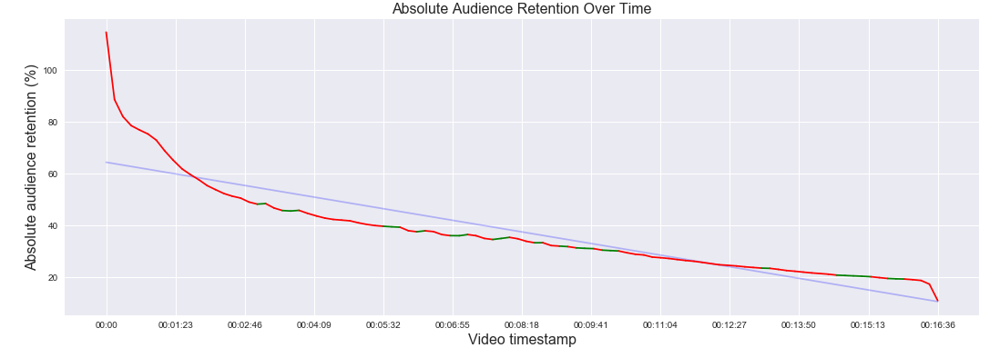
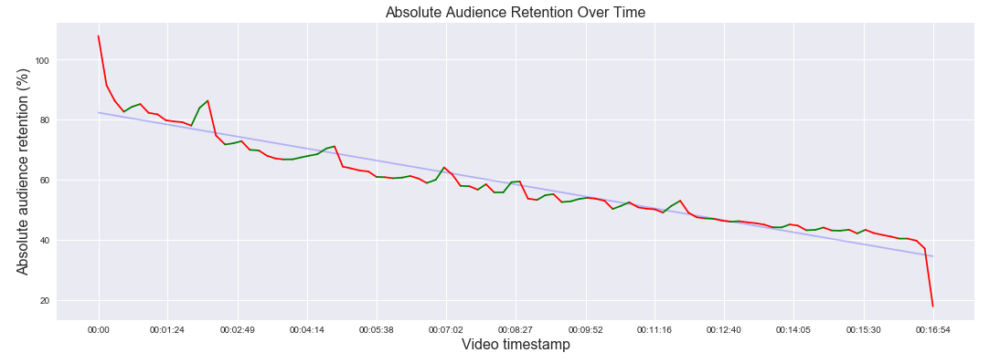

# retention-clipper

This script takes a .csv file of a YouTube video's absolute audience retention over time, then finds the timestamps where viewer retention is higher or more stable than usual.

## Ex. 1: Low retention

## Ex. 2: Good retention

